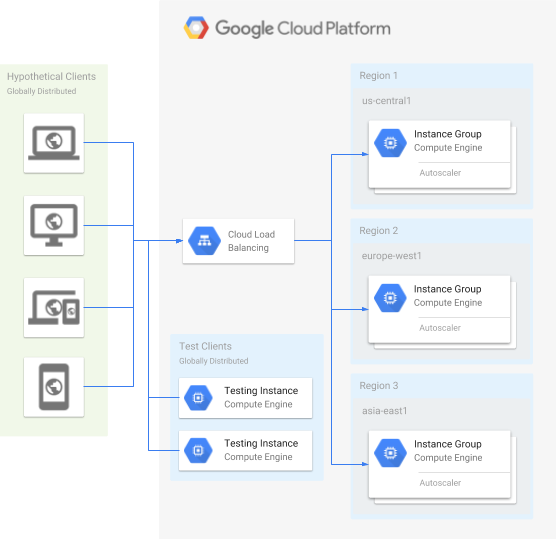

<br><br>
<br><br>
<br><br>

# Global Load Balancer

W tym laboratorium zobaczysz jak Global Load Balancer kierujący ruch do regionu najbliżej użytkownika (wraz z opcją przekierowywania do mniej obciążonego regionu).



---

## Krok 1: Uruchom Cloud Shell

Wszystkie komendy będziemy wpisywali z poziomu Cloud Shell.

## Krok 2: Stwórz Network oraz Firewall Rules

Network:

```bash
gcloud compute networks create fortressnet --subnet-mode auto
```

Firewall Rules:

```bash
gcloud compute firewall-rules create fortressnet-allow-http --network fortressnet --allow tcp:80
```

## Krok 3: Stwórz Instance Template i zastosuj go dla Instance Groups w kilku regionach

Instance Template:

```bash
gcloud compute instance-templates create fort-template \
  --machine-type e2-micro \
  --network fortressnet \
  --metadata startup-script='apt update && apt -y install apache2'
```

Instance Groups:

1. `us-cental1`

   ```bash
   gcloud compute instance-groups managed create us-central1-pool \
     --region us-central1 \
     --template fort-template \
     --size 1
   ```

   ```bash
   gcloud compute instance-groups managed set-autoscaling us-central1-pool \
     --region us-central1 \
     --min-num-replicas 1 \
     --max-num-replicas 2 \
     --scale-based-on-load-balancing \
     --target-load-balancing-utilization .8
   ```

1. `europe-west1`

   ```bash
   gcloud compute instance-groups managed create europe-west1-pool \
     --region europe-west1 \
     --template fort-template \
     --size 1
   ```

   ```bash
   gcloud compute instance-groups managed set-autoscaling europe-west1-pool \
     --region europe-west1 \
     --min-num-replicas 1 \
     --max-num-replicas 2 \
     --scale-based-on-load-balancing \
     --target-load-balancing-utilization .8
   ```

1. `asia-east1`

   ```bash
   gcloud compute instance-groups managed create asia-east1-pool \
     --region asia-east1 \
     --template fort-template \
     --size 1
   ```

   ```bash
   gcloud compute instance-groups managed set-autoscaling asia-east1-pool \
     --region asia-east1 \
     --min-num-replicas 1 \
     --max-num-replicas 2 \
     --scale-based-on-load-balancing \
     --target-load-balancing-utilization .8
   ```

## Krok 4: Sprawdź czy instancje odpowiadają

1. Wylistuj instancje i ich Extrnal IP

   ```bash
   gcloud compute instances list
   ```

1. Wykonaj request do serwera

   ```bash
   curl http://<EXTERNAL_IP> | head
   ```

## Krok 5: Skonfiguruj Load Balancer

1. Stwórz podstawowy Health Check, który sprawdzi czy Load Balancer odpowiada na zapytania HTTP

   ```bash
   gcloud compute health-checks create http http-basic-check
   ```

1. Stwórz globalny Backend Service (abstrakcja zamykająca kilka usług z różnych lokalizacji w jedną usługę). Ten Backend Service będzie otrzymywał ruch z Load Balancera.

   ```bash
   gcloud compute backend-services create fortressnet-backend-service \
     --protocol HTTP \
     --health-checks http-basic-check \
     --global
   ```

1. Dodaj Instance Groups do Backend Service

   - `us-central1`

      ```bash
      gcloud compute backend-services add-backend fortressnet-backend-service \
          --balancing-mode RATE \
          --max-rate-per-instance 100 \
          --instance-group us-central1-pool \
          --instance-group-region us-central1 \
          --global
      ```

   - `europe-west1`

      ```bash
      gcloud compute backend-services add-backend fortressnet-backend-service \
          --balancing-mode RATE \
          --max-rate-per-instance 100 \
          --instance-group europe-west1-pool \
          --instance-group-region europe-west1 \
          --global
      ```

   - `asia-east1`

      ```bash
      gcloud compute backend-services add-backend fortressnet-backend-service \
          --balancing-mode RATE \
          --max-rate-per-instance 100 \
          --instance-group asia-east1-pool \
          --instance-group-region asia-east1 \
          --global
      ```

1. Skonfiguruj URL Map, który przekieruje jeden adres na wiele różnych adresów Instance Groups

   ```bash
   gcloud compute url-maps create fortressnet-balancer --default-service fortressnet-backend-service
   ```

1. Stwórz HTTP Proxy, który będzie przyjmował requesty HTTP i przekieruje je na odpowiednie URL

   ```bash
   gcloud compute target-http-proxies create fortressnet-http-proxy --url-map fortressnet-balancer
   ```

1. Stwórz statyczny adres IP (IPv4 oraz IPv6)

   - IPv4

      ```bash
      gcloud compute addresses create fortressnet-ip \
        --ip-version IPV4 \
        --global
      ```

   - IPv6

      ```bash
      gcloud compute addresses create fortressnet-ipv6 \
        --ip-version IPV6 \
        --global
      ```

1. Pobierz przypisane statyczne adresy IP

   ```bash
   gcloud compute addresses list
   ```

1. Przekieruj ruch ze statycznego adresu IP na HTTP Proxy

   - IPv4

      ```bash
      gcloud compute forwarding-rules create fortressnet-http-rule \
        --global \
        --target-http-proxy fortressnet-http-proxy \
        --ports 80 \
        --address <LOAD_BALANCER_IP_ADDRESS>
      ```

   - IPv6

      ```bash
      gcloud compute forwarding-rules create fortressnet-http-ipv6-rule \
        --global \
        --target-http-proxy fortressnet-http-proxy \
        --ports 80 \
        --address <LOAD_BALANCER_IPV6_ADDRESS>
      ```

## Krok 6: Sprawdź czy usługa jest dostępna wywołując ją po statycznym IP

   ```bash
   curl http://<LOAD_BALANCER_IP_ADDRESS> | head
   ```

   W przypadku otrzymania odpowiedzi zawierającej fragment jak poniżej odczekaj 2 minuty i spróbuj ponownie.

   ```bash
   <title>Error 404 (Not Found)!!1</title>
   ```

## Krok 7: Skonfiguruj Firewall pozwalając tylko ruch do VM instance tylko z Load Balancer i Health Check

1. Skonfiguruj Firewall

   ```bash
   gcloud compute firewall-rules create fortressnet-allow-load-balancer \
     --network fortressnet \
     --source-ranges 130.211.0.0/22,35.191.0.0/16 \
     --allow tcp:80
   ```

   **Czym są podane adresy IP?**

   > `130.211.0.0/22` is the source IP for any request redirected by a Compute Engine **Load Balancer**. 
   > `35.191.0.0/16 is the source IP for any request sent by a Compute Engine **Health Check**.`

1. Usuń poprzednią Firewall Rule

   ```bash
   gcloud compute firewall-rules delete fortressnet-allow-http -q
   ```

## Krok 8: Przetestuj działanie autoskalowania

1. Utwórz VM instance do wykonania stress test

   ```bash
   gcloud compute instances create europe-loadtest \
     --network default \
     --zone europe-west1-c \
     --metadata startup-script='apt -y install siege'
   ```

   **Czym jest siege?**

   > Siege is a Hypertext Transfer Protocol (HTTP) and HTTPS load testing and web server benchmarking utility
   > ([link](https://en.wikipedia.org/wiki/Siege_(software)))

1. Zaloguj się na nią SSH (z UI lub terminala)

   ```bash
   gcloud compute ssh --zone europe-west1-c europe-loadtest
   ```

1. Uruchom benchmark (i pozostaw go aktywnego na kilka minut)

   ```bash
   siege -c150 http://<LOAD_BALANCER_IP_ADDRESS>
   ```

## Krok 9: Wyświetl wizualizację ruchu w portalu GCP

1. Przejdź do menu _Network services_ > _Load balancing_ i wybierz odpowiedni Load Balancer
1. Przejdź do zakładki _Monitoring_ i wybierz odpowiedni Backend
1. Jeśli jeszcze nie widzisz wizualizacji ruchu poczekaj około 2 minuty
1. Zauważ na ile instancji rozkłada się ruch oraz pomiędzy jakimi regionami

## Krok 10: Wygeneruj ruch z dodatkowego regionu

1. Utwórz VM instance do wykonania stress test

   ```bash
   gcloud compute instances create asia-loadtest \
     --network default \
     --zone europe-west1-c \
     --metadata startup-script='apt -y install siege'
   ```

1. Zaloguj się na nią SSH (z UI lub terminala)

   ```bash
   gcloud compute ssh --zone asia-east1-c asia-loadtest
   ```

1. Uruchom benchmark (i pozostaw go aktywnego na kilka minut)

   ```bash
   siege -c150 http://<LOAD_BALANCER_IP_ADDRESS>
   ```

1. Odczekaj około 2 minuty i sprawdź wizualizację ruchu w portalu GCP

---

**Koniec laboratorium**

<br><br>

<center><p>&copy; 2021 Chmurowisko Sp. z o.o.<p></center>
