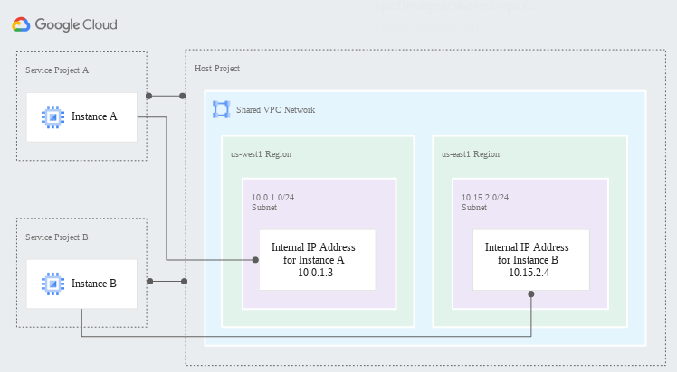
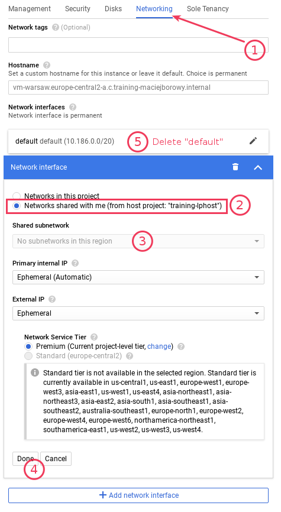
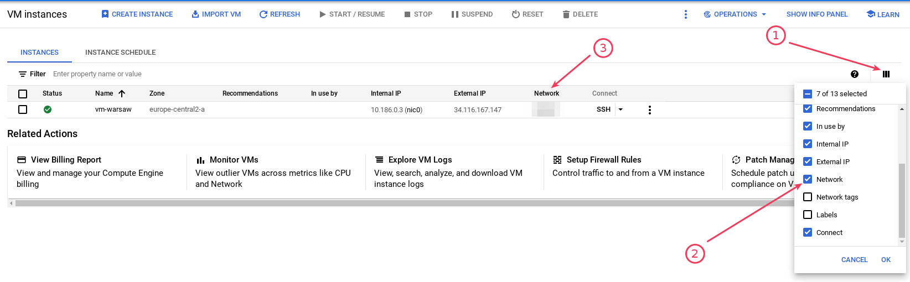
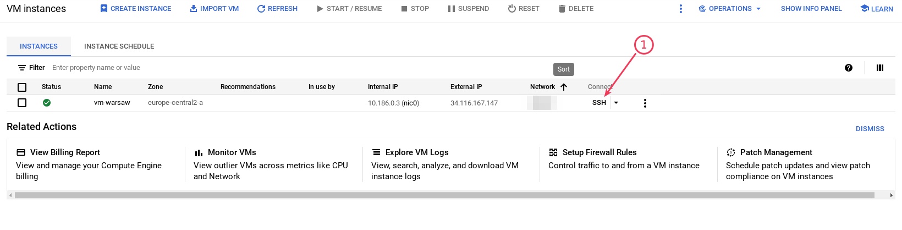

<br><br>
<br><br>
<br><br>

# Podłączenie Compute Engine do Shared VPC

W tym laboratorium zobaczysz jak stworzyć Shared VPC (demo prowadzącego) i dołączysz do niej swoją VM.



---

## Demo: Utworzenie VPC

Sieć:

```bash
name: shared-vpc-network
subnets:
  - name: subnet-belgium
    region: europe-west1
    IP range: 10.10.0.0/20
  - name: subnet-warsaw
    region: europe-central2
    IP range: 10.22.0.0/20
```

## Demo: Utworzenie Shared VPC

-

## Demo: Dodanie Firewall Rules

Konfiguracja reguły firewall:

```bash
name: shared-vpc-allow-internal
subnet: shared-vpc-network
IP ranges: 10.10.0.0/20, 10.22.0.0/20
Protocols and ports: all
```

Dla łatwości testu udostępniamy wszystkie protokoły i porty dla ruchu z podanych zakresów IP.

## Krok 1: Utworzenie VM połączonej do Shared VPC

Utwórz nową instancję VM:

```bash
name: vm-warsaw
region: europe-central2
machine type: e2-micro
```

Zmień ustawienia "Networking":

1. dodaj nowy Network Interface
1. wybierz "Networks shared with me"
1. wybierz odpowiedni Shared subnetwork
1. klinij "Done"
1. **Usuń sieć "default"**



## Krok 2: Upewnij się do jakiej sieci należy Twoja maszyna

1. Na liście VM instances dodaj nową kolumnę do wyświetlenia
1. Upewnij się, że VM jest podłączona do sieci `shared-vpc-network`



## Krok 3: Test połączenia z innymi maszynami w sieci

1. Sprawdź internal IP swojej maszyny
1. Wklej IP maszyny na czat
1. Skopiuj IP maszyny innego uczestnika
1. Zaloguj się SSH do maszyny
1. Spróbuj wykonać `ping <IP innej maszyny>`. Powinieneś otrzymać spodziewaną odpowiedź.


---

**Koniec laboratorium**

<br><br>

<center><p>&copy; 2021 Chmurowisko Sp. z o.o.<p></center>
