<br><br>
<br><br>
<br><br>

# Pobieranie danych z Firestore oraz Live Reload

W tym ćwiczeniu poznasz sposoby pobierania danych z Firestore

---

## Krok 1: Stwórz projekt w Firebase

1. Wejdź na stronę [console.firebase.google.com](https://console.firebase.google.com)
1. Stwórz nowy projekt

   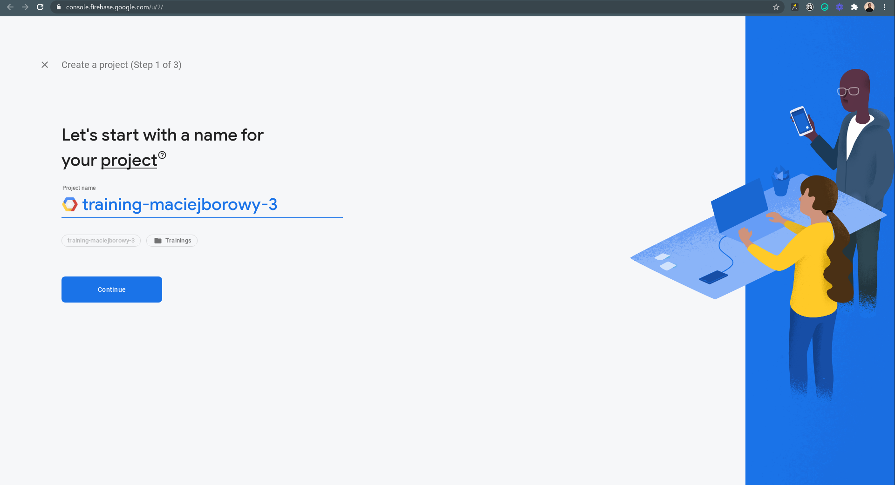

1. Potwierdź billing

   
   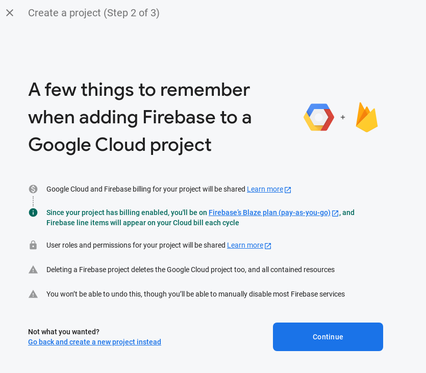

1. Wyłącz Google Analytics

   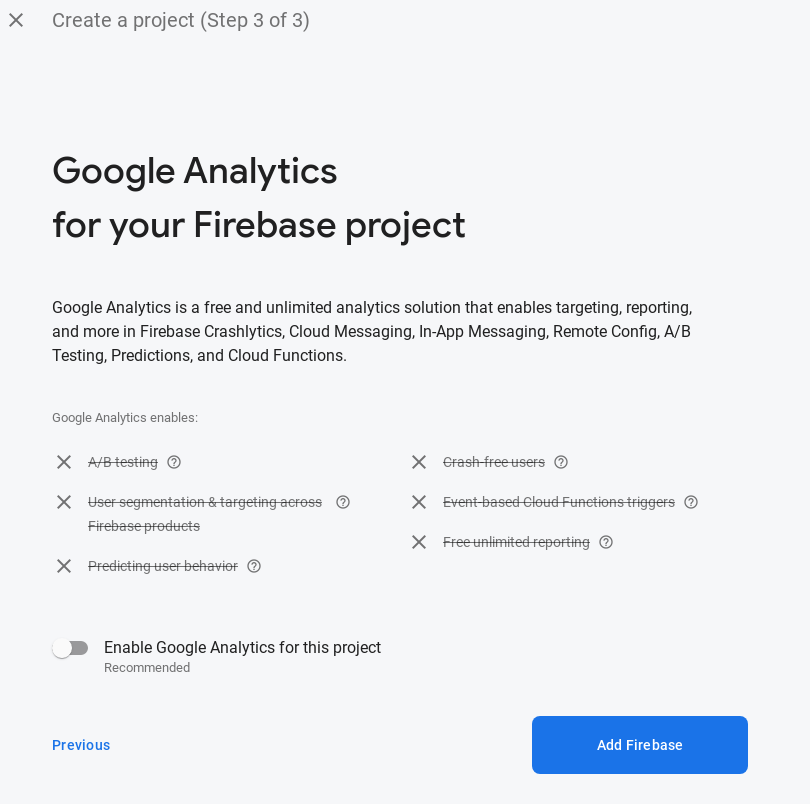

1. Poczekaj na utworzenie projektu

   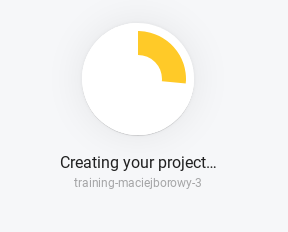

1. W rezultacie powinieneś ujrzeć widok:

   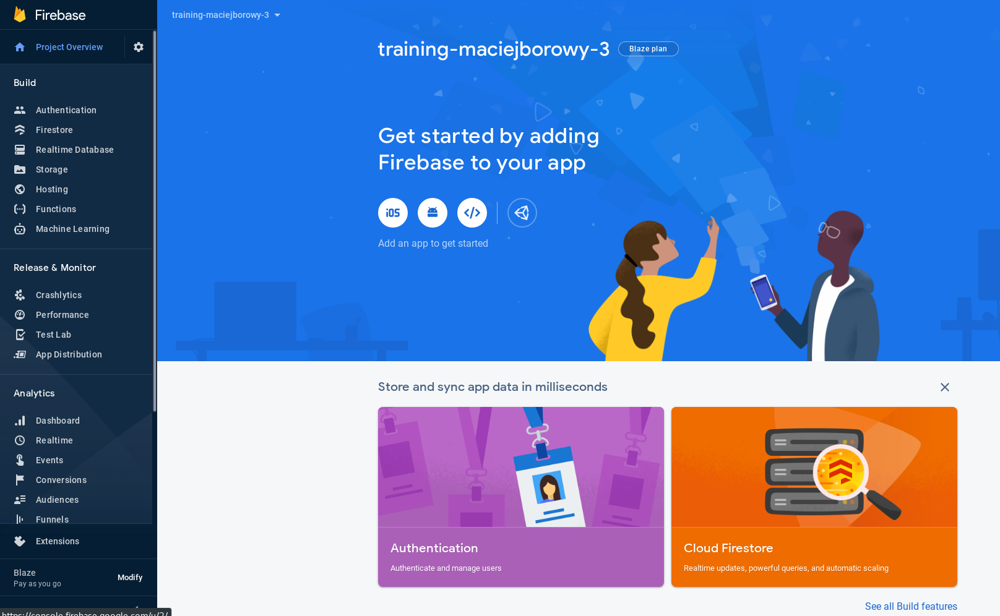

## Krok 2: Skonfiguruj Firestore

1. Przejdź do zakładki Firestore i kliknij "Create database"

   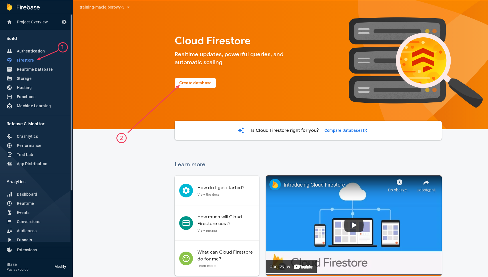

1. Pozostaw domyślne ustawienia i kliknij "Enable"

   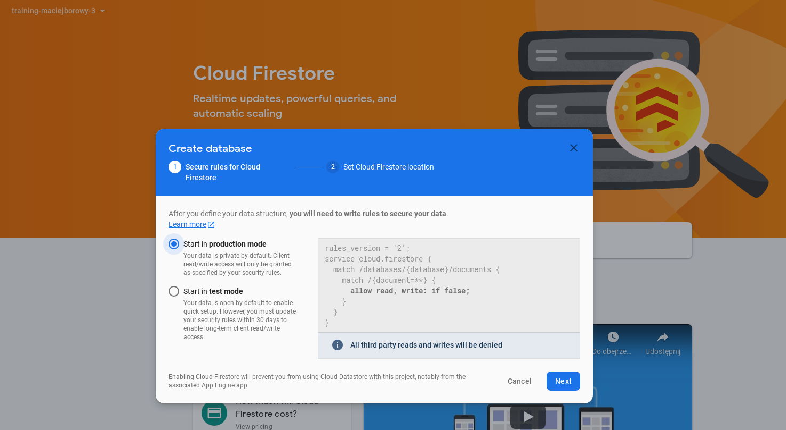
   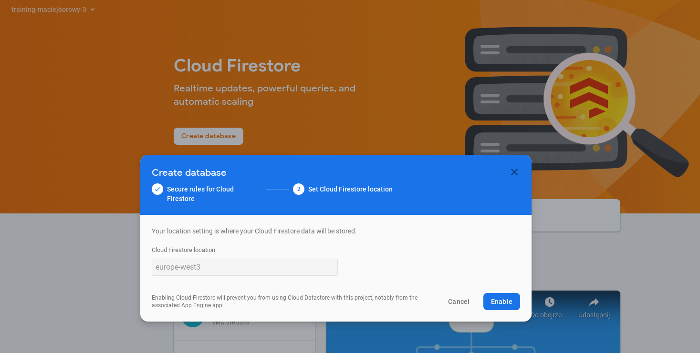

1. W efekcie powinieneś zobaczyć poniższy widok

   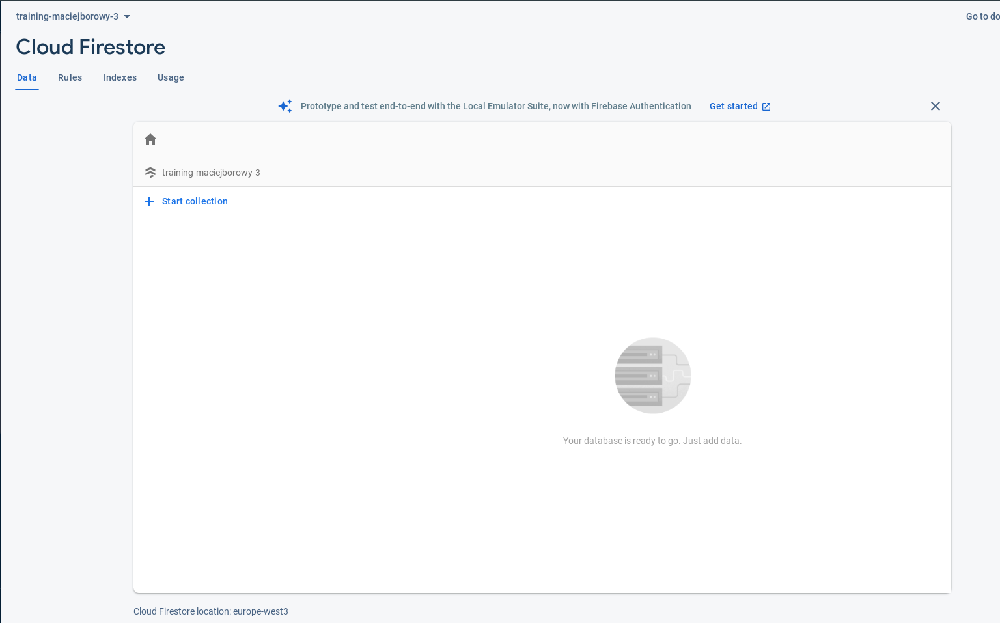

## Krok 3: Pobierz _credentials_ do połączenia z bazą danych

1. Przejdź do ustawień projektu

   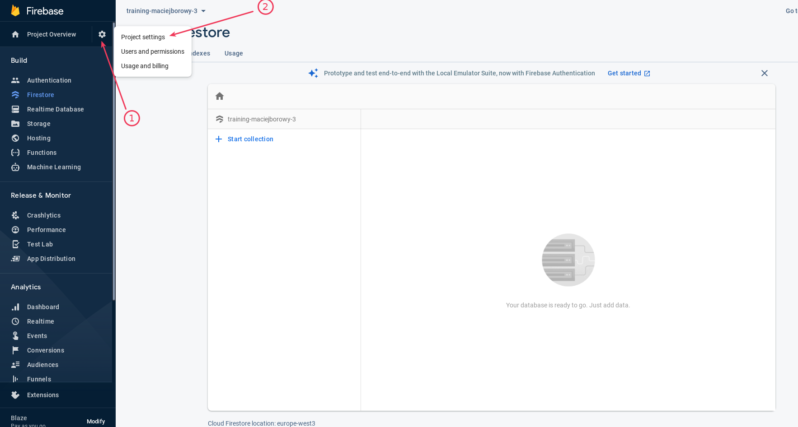

1. Kliknij w przycisk konfigurowania Web App

   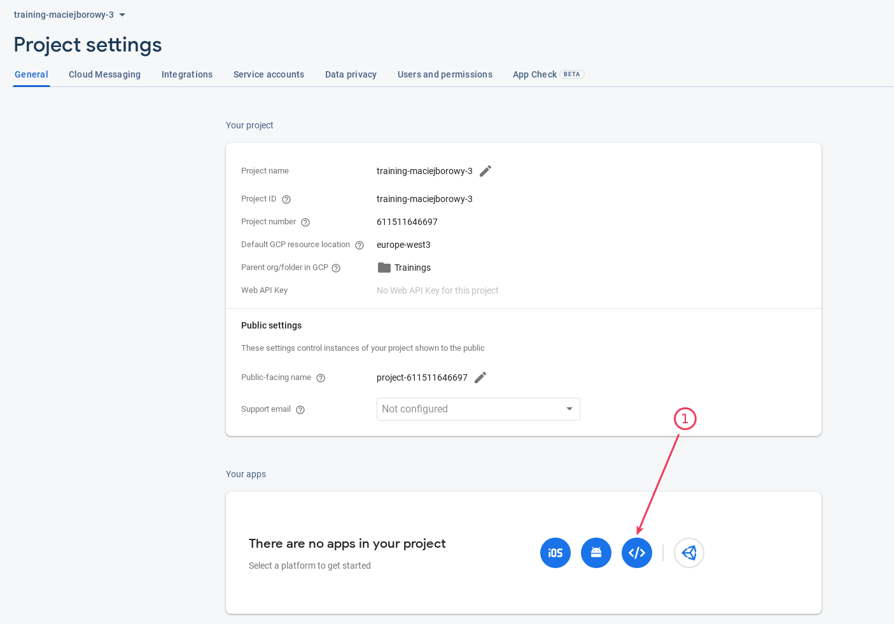

1. Nazwij aplikację "My Web App"

   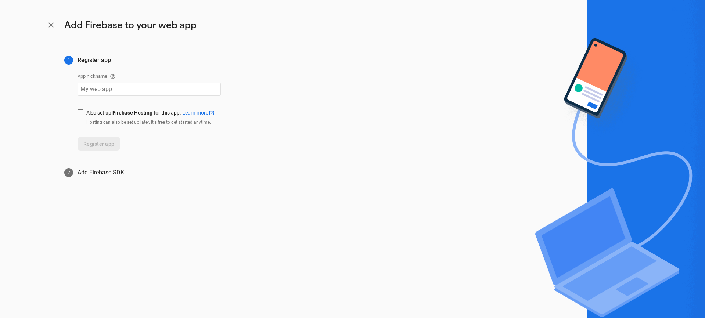

1. W efekcie powinieneś zobaczyć poniższy widok. Na razie nie klikaj "Continue to console" i pozostań na tym widoku. W następnych krokach skopiujemy stąd wartości do połączenia z bazą.

   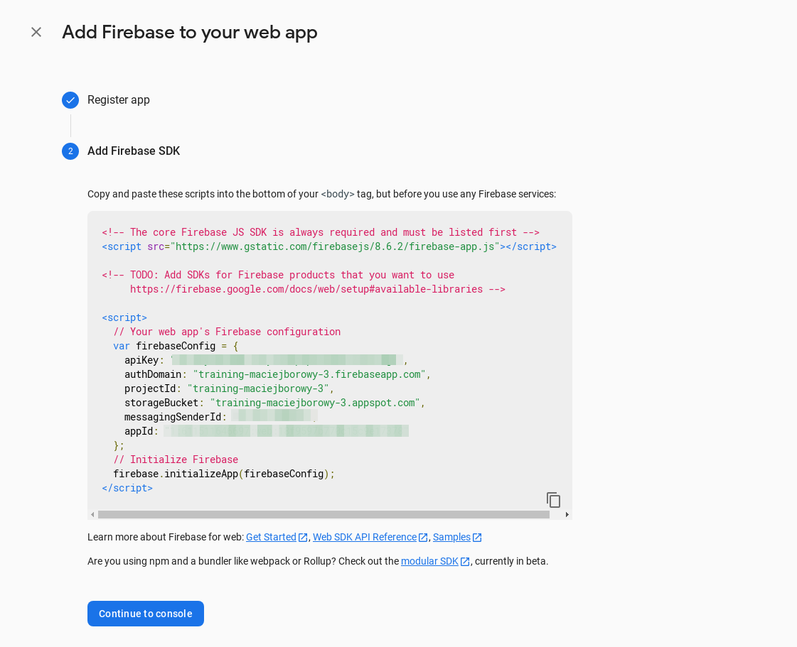

## Krok 4: Dodaj konfigurację Firebase do kodu aplikacji

1. Zastąp:

   ```javascript
   // Zastąp firebaseConfig do swojej usługi
   const firebaseConfig = {
     apiKey: 
     authDomain: 
     projectId: 
     storageBucket: 
     messagingSenderId: 
     appId: 
   };
   ```

   fragmentem kodu skopiowanym z przeglądarki w poprzednim kroku.

1. Zainstaluj zależności aplikacji `npm i`
1. Uruchom aplikację `npm start` i sprawdź czy aplikacja działa. Pracując z Cloud Shell możesz skorzystać z Web Preview:

   

## Krok 5: Dodaj kod pobierający dane z bazy danych

1. Zastąp kod endpoint `/`:

   ```javascript
   app.get("/", async (_, res) => {
     res.json({ status: "ok", data: null });
   });
   ```

   poniższym fragmentem kodu:

   ```javascript
   app.get("/", async (_, res) => {
     let ref = db.collection("users");
     const data = await ref.get();
     const users = data.docs.map(doc => { return {...doc.data(), id: doc.id} });
   
     res.json({ status: "ok", data: users });
   });
   ```

1. Stwórz kolekcję `users` w bazie danych oraz dodaj dowolny dokument

   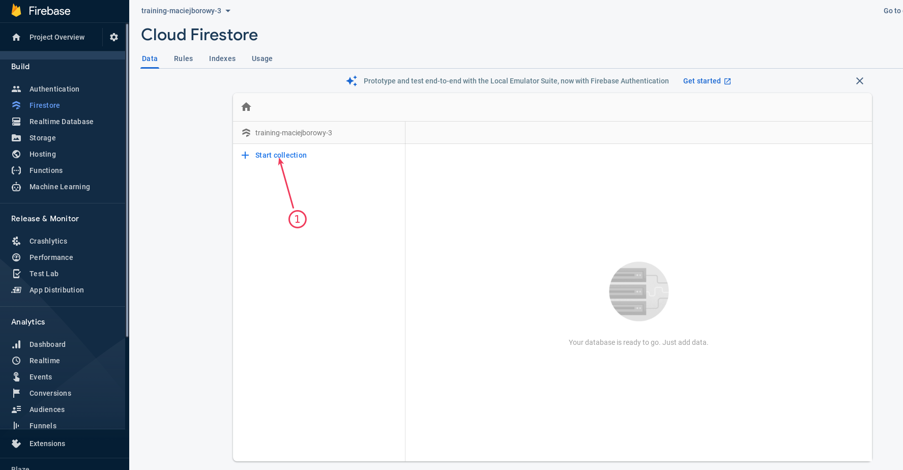
   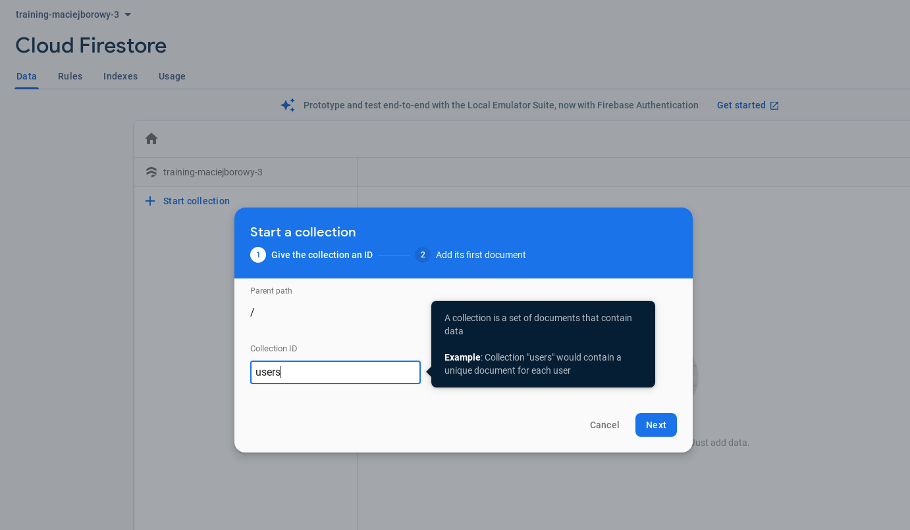
   

1. Sprawdź czy możesz wyświetlić dane z bazy danych wyświetlając stronę aplikacji lub wykonując zapytanie `curl`. W razie problemów sprawdź logi aplikacji.

## Krok 6: Dodaj uprawnienia do wyświetlania dokumentów z bazy danych

1. Przejdź do zakładki Rules dla Firestore

   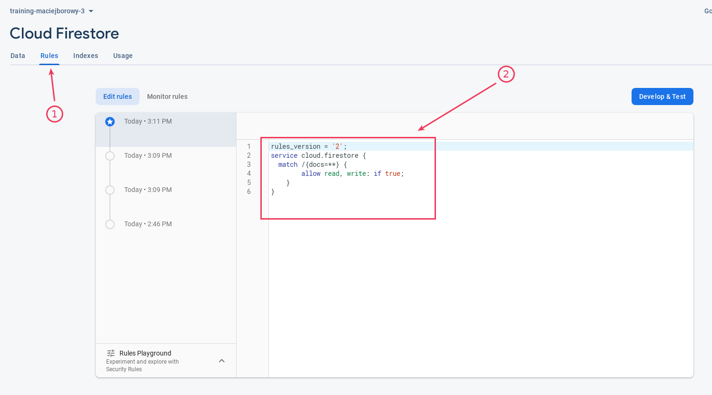

1. Zastąp domyślny kod, który został dodany przez Firestore poniższym:

   ```javascript
   rules_version = '2';
   service cloud.firestore {
     match /{docs=**} {
           allow read, write: if true;
       }
   }
   ```

1. Spróbuj ponownie wyświetlić dane w aplikacji

## Krok 7: Dodaj kod odbierający informacje o zmianie danych w bazie danych

1. Zastąp:

   ```javascript
   // ********************************************** //
   //                                                //
   // Tu wklej kod pozwalający na live reload danych //
   //                                                //
   // ********************************************** //
   ```

   poniższym kodem:

   ```javascript
   const ref = (db).collection("users");
   ref.onSnapshot(
     snapshot => {
       const items = snapshot.docs.map(item => item.data());
       console.log(items);
     },
     e => {
       console.error('Error', e);
     }
   );
   ```

1. Uruchom aplikacje ponownie i zobacz czy w logach wypisała szczegóły obiektu/-ów w kolekcji `users`
1. Ręcznie dodaj zmianę w kolekcji `users` (np. dodaj nowy dokument lub zmień dane wybranego)
1. Sprawdź czy aplikacja wypisała nowe dane

---

**Koniec laboratorium**

<br><br>

<center><p>&copy; 2021 Chmurowisko Sp. z o.o.<p></center>
