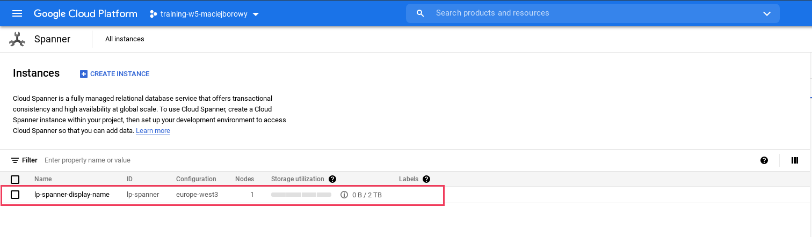
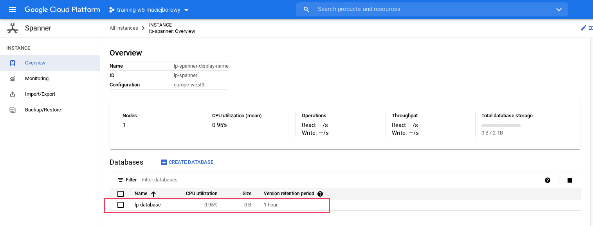
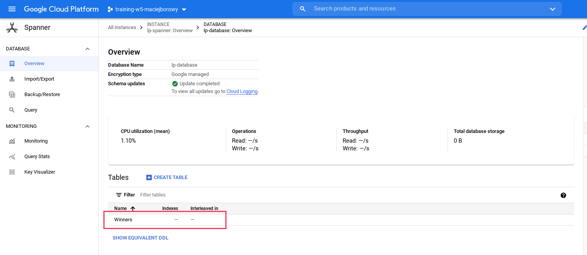
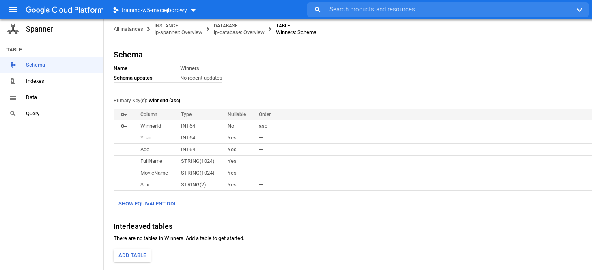
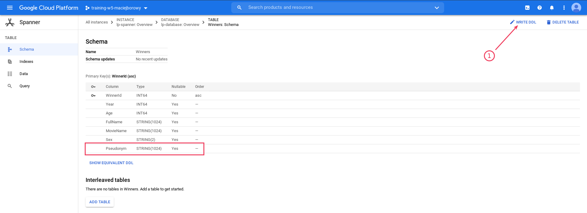
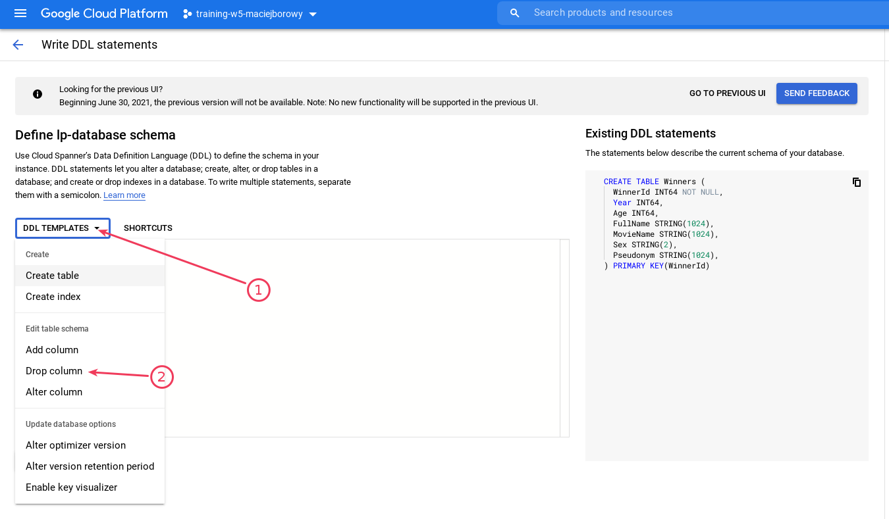
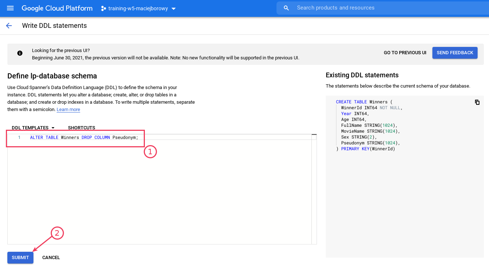
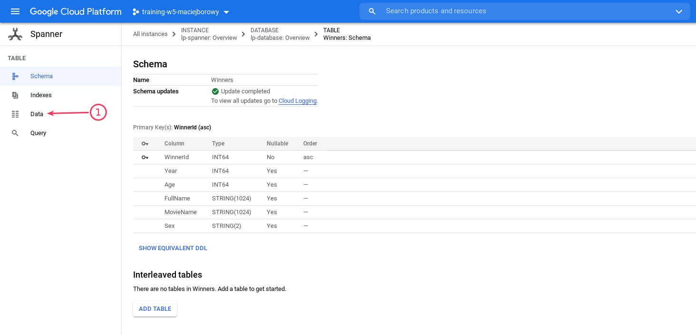
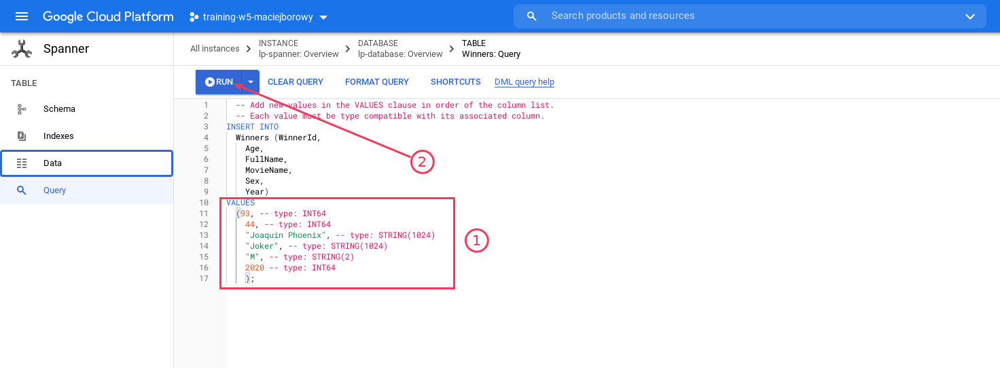

<br><br>
<br><br>
<br><br>

# Utworzenie instancji Cloud Spanner

W tym laboratorium utworzysz nową instancję bazy danych w Cloud Spanner i zasilisz ją kilkoma rekordami. Zobaczysz też jak pobrać dane z bazy danych.

---

## Krok 1: Sprawdź dostępne konfiguracje usługi Cloud Spanner

```bash
gcloud spanner instance-configs list
```

- zaczynające się od `regional-*` są tylko w jednym regionie
- multi-region - sprawdź jakie regiony biorą udział

## Krok 2: Utwórz instancję usługi Cloud Spanner

### Konfiguracja regional:

- ID instancji: `lp-spanner`
- Description (name): `lp-spanner-display-name`
- Region: `europe-west3`
- Nodes: `1`

```bash
gcloud spanner instances create lp-spanner --config=regional-europe-west3 --nodes=1 --description=lp-spanner-display-name
```

Ta komenda tworzy wykorzystywane przez Cloud Spanner zasoby.



## Krok 3: Utwórz instancję bazy danych Spanner

- Nazwa bazy danych: `lp-database`

```bash
gcloud spanner databases create lp-database --instance=lp-spanner
```

Ta komenda tworzy instancję bazy danych:



## Krok 4: Dodaj schema bazy danych

Schemat tworzonej tabeli:

```sql
CREATE TABLE Winners (
   WinnerId INT64 NOT NULL,
   Year INT64,
   Age INT64,
   FullName STRING(1024),
   MovieName STRING(1024),
   Sex STRING(2)
) PRIMARY KEY(WinnerId);
```

Komenda tworząca tabelę:

```bash
gcloud spanner databases ddl update lp-database --instance=lp-spanner --ddl='CREATE TABLE Winners (WinnerId INT64 NOT NULL, Year INT64, Age INT64, FullName STRING(1024), MovieName STRING(1024), Sex STRING(2)) PRIMARY KEY(WinnerId);'
```




## Krok 5: Zmień schema

### Dodaj kolumnę przez gcloud

```bash
gcloud spanner databases ddl update lp-database --instance=lp-spanner --ddl='ALTER TABLE Winners ADD COLUMN Pseudonym STRING(1024);'
```

### Usuń kolumnę przez Google Cloud Console





## Krok 6: Wstaw dane

### Dodaj pojedynczy rekord przez gcloud

- Korzystając z `gcloud spanner rows inster`

   ```bash
   gcloud spanner rows insert --table=Winners --database=lp-database --instance=lp-spanner --data=WinnerId=91,Year=2018,Age=59,FullName="Gary Oldman",MovieName="Darkest Hour",Sex="M"
   ```

- Korzystając z `gcloud spanner databases execute-sql`

   ```bash
   gcloud spanner databases execute-sql lp-database --instance=lp-spanner --sql='INSERT INTO Winners (WinnerId, Year, Age, FullName, MovieName, Sex) VALUES (92, 2019, 37, "Rami Malek", "Bohemian Rhapsody", "M");'
   ```

### Dodaj pojedynczy rekord przez Google Cloud Console

1. Przejdź do tabeli `Winners`

   

1. Dodaj następujące dane

   ```yaml
   WinnerId: 93
   Year: 2020
   Age: 44
   FullName: "Joaquin Phoenix"
   MovieName: "Joker"
   Sex: "M"
   ```

   

1. Sprawdź czy dane zostały dodane (zakładka "Data")

## Krok 7: Pobierz dane z tabeli

### Pobierz dane z tabeli przez gcloud

```bash
gcloud spanner databases execute-sql lp-database --instance=lp-spanner --sql='SELECT * FROM Winners ORDER BY Age;'
```

### Pobierz dane z tabeli przez Google Cloud Console

```sql
SELECT * FROM Winners ORDER BY Age DESC;
```

---

**Koniec laboratorium**

<br><br>

<center><p>&copy; 2021 Chmurowisko Sp. z o.o.<p></center>
