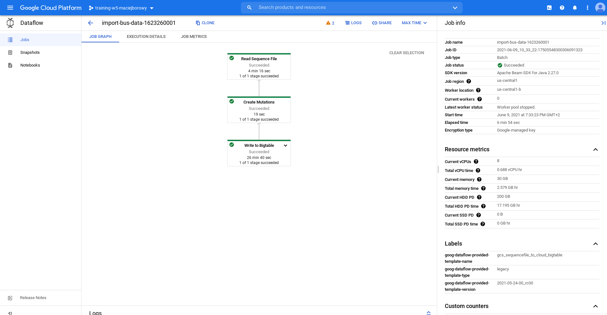
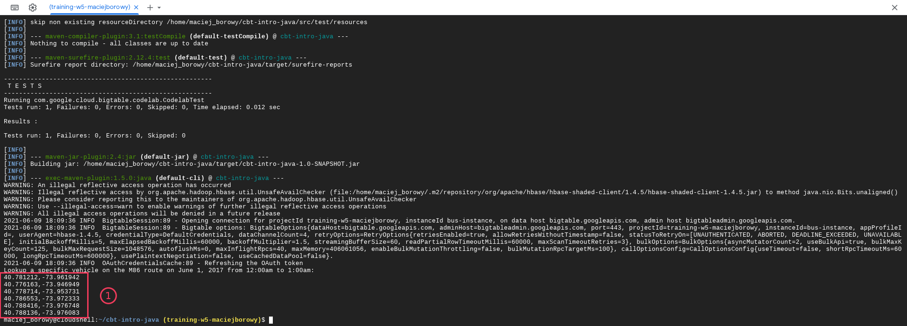

<br><br>
<br><br>
<br><br>

# TBA

W tym laboratorium przeanalizujesz zbiór danych [kursów autobusów po Manhattanie](https://www.kaggle.com/stoney71/new-york-city-transport-statistics)

---

## Krok 1: Uruchom Cloud Shell

W tym laboratorium wszystkie komendy będziemy wykonywać z poziomu Cloud Shell, ponieważ ma on już zainstalowane narzędzie `cbt`.

## Krok 2: Utwórz instancje Cloud BigTable

Utwórz zmienne środowiskowe zawierające wartości, których użyjesz podczas tworzenia i konfigurowania usługi:

```bash
INSTANCE_ID="bus-instance"
CLUSTER_ID="bus-cluster"
TABLE_ID="bus-data"
CLUSTER_NUM_NODES=3
CLUSTER_ZONE="us-central1-c"
```

Utwórz usługę:

```bash
gcloud bigtable instances create $INSTANCE_ID \
    --cluster=$CLUSTER_ID \
    --cluster-zone=$CLUSTER_ZONE \
    --cluster-num-nodes=$CLUSTER_NUM_NODES \
    --display-name=$INSTANCE_ID
```

Następnie utwórz plik konfiguracyjny dla narzędzia `cbt`:

```bash
echo project = $GOOGLE_CLOUD_PROJECT > ~/.cbtrc
echo instance = $INSTANCE_ID >> ~/.cbtrc

cbt createtable $TABLE_ID
cbt createfamily $TABLE_ID cf
```

Sprawdź czy tabela została utworzona:

```bash
cbt ls
```

## Krok 3: Zaimportuj dane do Bigtable

Rozpocznij import danych:

```bash
NUM_WORKERS=$(expr 3 \* $CLUSTER_NUM_NODES)
gcloud beta dataflow jobs run import-bus-data-$(date +%s) \
--gcs-location gs://dataflow-templates/latest/GCS_SequenceFile_to_Cloud_Bigtable \
--num-workers=$NUM_WORKERS --max-workers=$NUM_WORKERS \
--parameters bigtableProject=$GOOGLE_CLOUD_PROJECT,bigtableInstanceId=$INSTANCE_ID,bigtableTableId=$TABLE_ID,sourcePattern=gs://cloud-bigtable-public-datasets/bus-data/*
```

## Krok 4: Sprawdź status wykonania importu

Wejdź na stronę [https://console.cloud.google.com/dataflow](https://console.cloud.google.com/dataflow) i sprawdź status wykonania importu. 

Import będzie trwał około 7 minut.




Czas trwania podany w kolejnych krokach procesu jest sumą czasu spędzonego na wykonaniu pojedynczego kroku przez wszystkie Workery (u nas 9).

## Krok 5: Sprawdź status Bigtable

Wejdź na stronę [https://console.cloud.google.com/bigtable](https://console.cloud.google.com/bigtable) i sprawdź czy dane zostały zaimportowane do bazy danych.

Przejdź do zakładki "Monitoring" i sprawdź czy w ostatnich minutach na bazie danych były wykonywane jakieś operacje:


Przejdź do zakładki "Tables" i sprawdź rozmiar tabeli:


## Krok 6: Pobierz kod analizujący dane

```bash
git clone https://github.com/googlecodelabs/cbt-intro-java.git
cd cbt-intro-java
```

## Krok 7: Sprawdź aktualną wersję Java

Sprawdź wersje Java, która jest aktualnie ustawiona na Twoim środowisku:

```bash
echo $JAVA_HOME
```

Przejdź do następnego kroku jeśli wersja Java to:

```bash
/usr/lib/jvm/java-11-openjdk-amd64
```

Jeśli wersja Java jest inna wykonaj poniższe komendy:

```bash
sudo update-java-alternatives -s java-1.11.0-openjdk-amd64 && export JAVA_HOME=/usr/lib/jvm/java-11-openjdk-amd64/
```

Na potrzeby laboratorium zignoruj błąd:

```bash
update-alternatives: error: no alternatives for mozilla-javaplugin.so
```

## Krok 8: Wykonaj proste zapytanie

W tym kroku odpytasz bazę danych o przystanki, które odwiedził autobusu linii M86-SBS w dniu 01.06.2017 w godzinach od 00:00 do 01:00.

W celu pobrania danych o przystankach uruchom aplikację korzystając z poniższej komendy:

```bash
mvn package exec:java -Dbigtable.projectID=$GOOGLE_CLOUD_PROJECT \
-Dbigtable.instanceID=$INSTANCE_ID -Dbigtable.table=$TABLE_ID \
-Dquery=lookupVehicleInGivenHour
```

W razie otrzymania błędu sprawdź wartość zmiennej środowiskowej `GOOGLE_CLOUD_PROJECT`. W razie gdyby była pusta ustaw jej wartość na nazwę Twojego projektu w GCP:

```bash
GOOGLE_CLOUD_PROJECT=NAZWA_TWOJEGO_PROJEKTU
```

Poprawna odpowiedź z aplikacji powinna wyglądać następująco:



## Krok 9: Zwizualizuj dane

W tym kroku zwizualizujesz otrzymane dane na mapie. W tym celu będziesz musiał utworzyć darmowe konto na stronie [maps.co](maps.co).

1. Przejdź na stronę [maps.co](maps.co)

   

1. Zarejestruj się

   

1. Zaimportuj dane

   

1. Uzupełnij nazwę i przekopiuj output aplikacji Java (koordynaty)

   

1. Twoja mapa powinna wyglądać podobnie do tej:

   

---

**Koniec laboratorium**

<br><br>

<center><p>&copy; 2021 Chmurowisko Sp. z o.o.<p></center>
