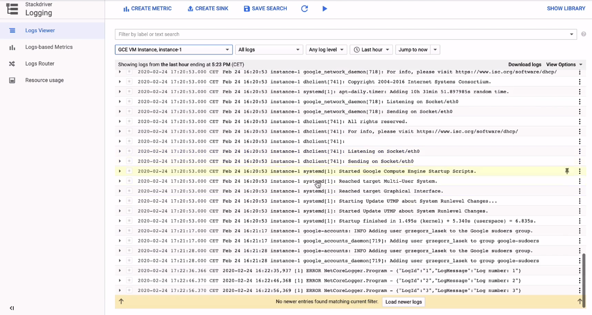

<br><br>
<br><br>
<br><br>

# Custom logs

## Krok 1: Utwórz maszynę wirtualną

1. Utwórz maszynę wirtualną w regionie `europe-west3`. Inne ustawienia pozostaw domyślnie.
1. Zaloguj się na maszynę SSH

## Krok 2: Skopiuj aplikację

1. Zainstaluj git na swojej maszynie

   ```bash
   sudo apt install git
   ```

1. Sklonuj to repozytorium

   ```bash
   git clone https://github.com/cloudstateu/lp-workshops
   ```

1. Przejdź do folderu z tym ćwiczeniem, a następnie do folderu `/app`

## Krok 3: Doinstaluj zależności na VM

1. Wykonaj poniższe komendy

   ```bash
   sudo apt install wget
   wget -qO- https://packages.microsoft.com/keys/microsoft.asc | gpg --dearmor > microsoft.asc.gpg
   sudo mv microsoft.asc.gpg /etc/apt/trusted.gpg.d/
   wget -q https://packages.microsoft.com/config/debian/9/prod.list
   sudo mv prod.list /etc/apt/sources.list.d/microsoft-prod.list
   sudo chown root:root /etc/apt/trusted.gpg.d/microsoft.asc.gpg
   sudo chown root:root /etc/apt/sources.list.d/microsoft-prod.list
   ```

1. Zainstaluj SDK .NET Core 3.1

   ```bash
   sudo apt-get update
   sudo apt-get install apt-transport-https
   sudo apt-get update
   sudo apt-get install dotnet-sdk-3.1
   ```
   
1. Sprawdź czy `dotnet` został zainstalowany

   ```bash
   dotnet --version
   ```

## Krok 4: Uruchom testowo aplikację

1. Uruchom aplikację poniższą komendą

   ```bash
   dotnet NetCoreLogger.dll
   ```

## Krok 5: Sprawdź czy powstał plik z logami aplikacji

1. Wyświetl zawartość pliku konfiguracyjnego:

   ```bash
   cat log4net.config
   ```

1. Sprawdź czy istnieje plik z logami w miejscu wskazanym przez konfigurację
1. Wyświetl zawartość pliku z logami

## Krok 6: Zainstaluj fluentd

1. Zainstaluj agenta fluentd

   ```bash
   curl -sSO https://dl.google.com/cloudagents/install-logging-agent.sh
   sudo bash install-logging-agent.sh
   ```

## Krok 7: Dodaj konfigurację własnej aplikacji do fluentd

1. Wyświetl zawartość katalogu `/etc/google-fluentd/config`
1. Dodaj nowy plik `netlogger.conf`. Otwórz go do edycji (`sudo nano netlogger.conf`) i uzupełnij go poniższą treścią (**zaktualizuj wartość `path`**; możesz wkleić kod skrótem `Shift + Insert`; usuń spacje na początku linii):

   ```
   <source>
   @type tail
   format none
   path /home/<lpstudentXX>/lp-workshops/labs/gcp/gcp_7/01_logging/app/main.log
   pos_file /var/lib/google-fluentd/pos/main.pos
   read_from_head true
   tag <tag>
   </source>
   ```

1. Zrestartuj agenta fluentd

   ```bash
   sudo service google-fluentd restart
   ```

## Krok 8: Uruchom aplikację i wyświetl logi w Operations Logging

1. Uruchom aplikację dotnet
1. Przejdź do Operations Logging i spróbuj znaleźć logi dla swojej maszyny wirtualnej
1. Na liście logów powinny pojawić się najnowsze logi z aplikacji:

   

## Krok 9: Usuń maszynę wirtualną

1. Przejdź do listy maszyn wirtualnych i usuń ją

---

**End of lab**

<br><br>

<center><p>&copy; 2021 Chmurowisko Sp. z o.o.<p></center>
