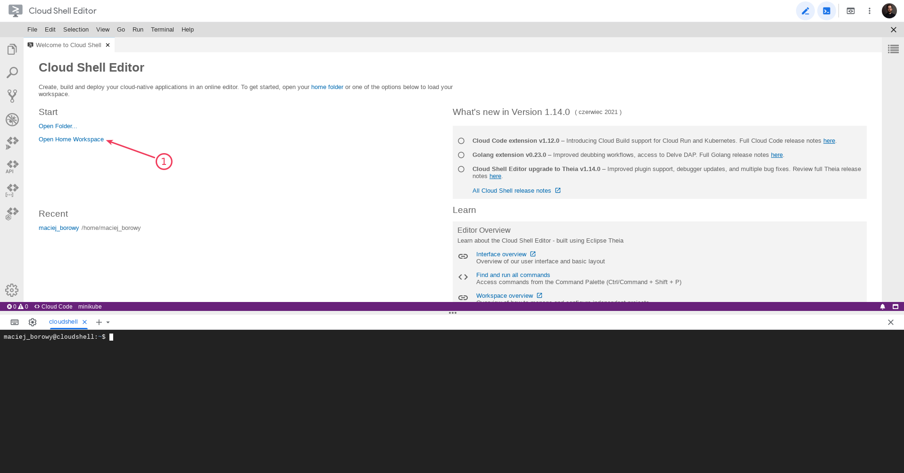
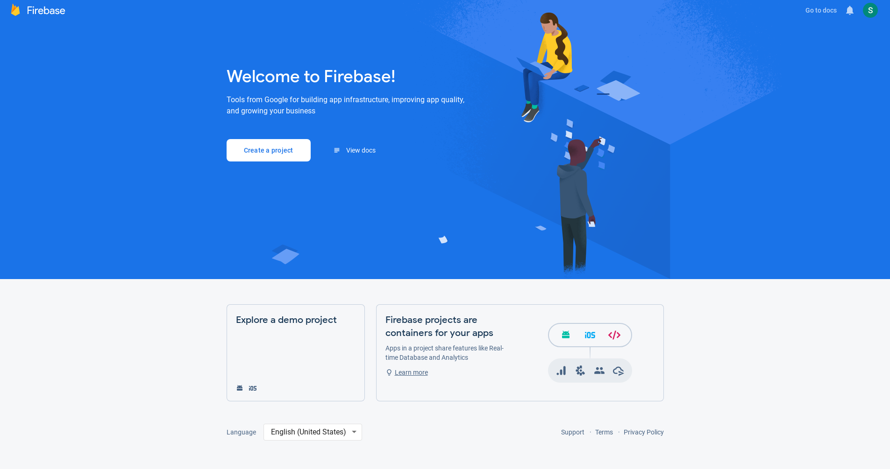
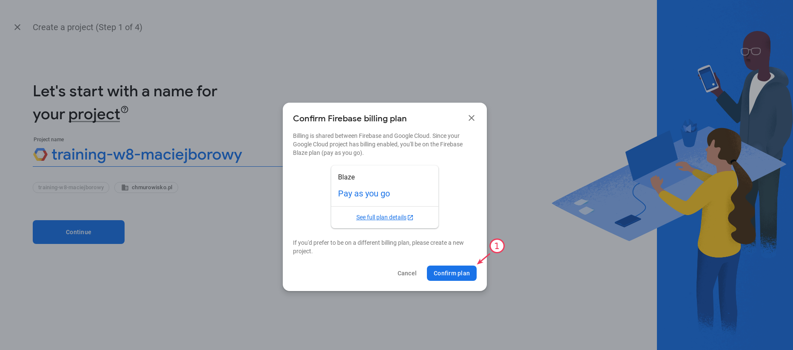

<br><br>
<br><br>
<br><br>

# Utworzenie projektu

W tym laboratorium utworzysz projekt w Firebase oraz zobaczysz jak używać Firebase CLI

## Krok 1: Uruchom Cloud Shell

1. Przejdź do [Cloud Shell](https://shell.cloud.google.com/) i otwórz "Home Workspace".

   

1. W terminalu wykonaj komendę

   ```bash
   firebase login --no-localhost
   ```

   Zrezygnuj z udostępniania danych telemetrycznych, jeśli zostaniesz zapytany:

   ```bash
   ? Allow Firebase to collect CLI usage and error reporting information? (Y/n) n
   ```

1. Kliknij w link do logowania i zaloguj się kontem studenta. Zezwól na dostęp do Firebase CLI. Skopiuj kod logowania.

1. Wróć do Cloud Shell i w terminalu wklej kod logowania.

1. Wykonaj komende:

   ```bash
   firebase projects:list
   ```

   Powinieneś otrzymać odpowiedź:

   ```bash
   ✔ Preparing the list of your Firebase projects
   No projects found.
   ```

## Krok 2: Utwórz nowy projekt w Firebase

1. Przejdź do [Firebase Console](https://console.firebase.google.com/). Upewnij się, że jesteś zalogowany kontem studenta. W tym momencie nie powinieneś mieć żadnego projektu.

   

1. Kliknij "Create a project". Wybierz sugerowaną nazwę projektu (według wzorca: `training-w8-lpstudentXX`). Potwierdź zaproponowany plan billingowy ("Blaze - pay as you go").

   

1. Wyłącz Google Analytics dla tego projektu (nie będziesz musiał go konfigurować 😃)

1. Kiedy projekt będzie gotowy wróć do Cloud Shell i ponownie wykonaj komendę:

   ```bash
   firebase projects:list
   ```

   W odpowiedzi powinieneś otrzymać:

   ```bash
   ✔ Preparing the list of your Firebase projects
   ┌──────────────────────────┬──────────────────────────┬────────────────┬──────────────────────┐
   │ Project Display Name     │ Project ID               │ Project Number │ Resource Location ID │
   ├──────────────────────────┼──────────────────────────┼────────────────┼──────────────────────┤
   │ training-w8-maciejborowy │ training-w8-maciejborowy │ 792703210973   │ [Not specified]      │
   └──────────────────────────┴──────────────────────────┴────────────────┴──────────────────────┘

   1 project(s) total.
   ```

---

**Koniec laboratorium**

<br><br>

<center><p>&copy; 2021 Chmurowisko Sp. z o.o.<p></center>
